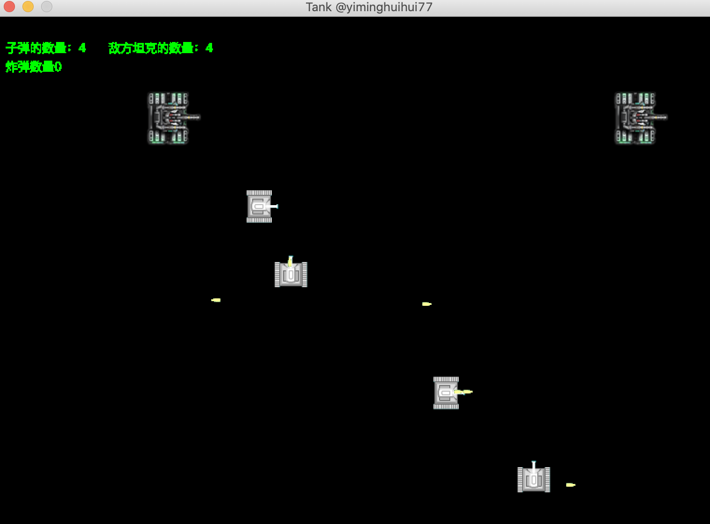

#坦克大战
_@Author_: minghui.y  
_@Date_: 2020-12-13  
_@Github_: <https://github.com/yiminghuihui77>  
_@CSDN_: <https://blog.csdn.net/SomeoneMH>  

##技术栈:

###1、AWT桌面程序

###2、设计模式
    * 单例模式： 生产产品族的工厂，如SimpleGameFactory、MultiGameFactory
 
    * 策略模式： 根据坦克是敌是友，采用不同的开火策略
 
    * 抽象工厂&工厂方法：创建产品族（坦克、子弹、爆炸），抽象工厂不易于扩展新的产品
 
    * 模板方法：坦克、子弹、爆炸的抽象基类中，定义了获取样式的抽象方法，由子类实现
 
    * 责任链: 各类model之间的碰撞检测，通过责任链处理
    
    * 门面模式(Facade): View(TankFrame)和各类model（坦克、子弹、爆炸）之间都存在交互
                       引入GameModel作为门面，相当于隔离了V和M
    * 调停者模式(Mediator): 所有model之间的冲突检测，都交给GameModel处理，各个model之间无直接接触
    
    * 观察者模式(Observer): 
    
    

###3、网络编程（Netty）

