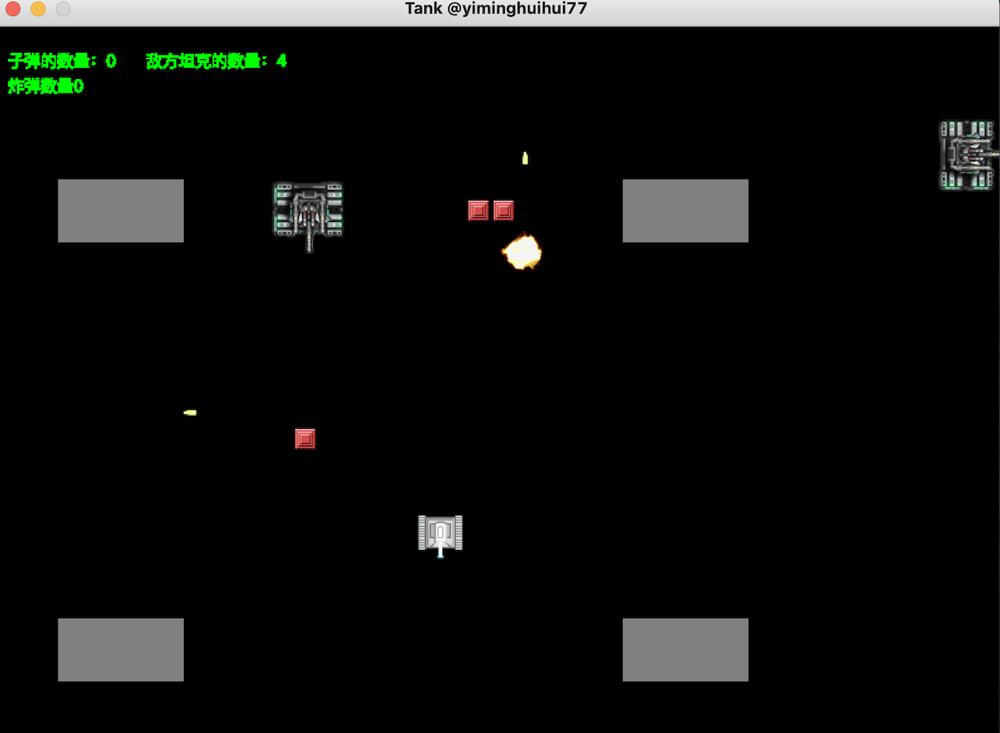

#坦克大战
__@Author__: minghui.y  
__@Date__: 2020-12-13  
__@Github__: <https://github.com/yiminghuihui77>  
__@CSDN__: <https://blog.csdn.net/SomeoneMH>  

##技术栈:

###1、AWT桌面程序

###2、设计模式    推荐读书：GOF（设计模式-可复用面向对象软件的基础）
    * 单例模式： 生产产品族的工厂，如SimpleGameFactory、MultiGameFactory
 
    * 策略模式： 根据坦克是敌是友，采用不同的开火策略
 
    * 抽象工厂&工厂方法：创建产品族（坦克、子弹、爆炸），抽象工厂不易于扩展新的产品
 
    * 模板方法：坦克、子弹、爆炸的抽象基类中，定义了获取样式的抽象方法，由子类实现
 
    * 责任链: 各类model之间的碰撞检测，通过责任链处理
             任务或事件，在责任链中传递，一般某个节点会匹配到任务并进行处理
             也可以让所有节点都对任务进行处理(类似于流水生产线)
             手写一个：javax.servet.FilterChain
    
    * 门面模式(Facade): View(TankFrame)和各类model（坦克、子弹、爆炸）之间都存在交互
                       引入GameModel作为门面，相当于隔离了V和M
    * 调停者模式(Mediator): 所有model之间的冲突检测，都交给GameModel处理，各个model之间无直接接触
    
    * 装饰器模式(Decorator): 对各类model进行装饰，被装饰物为BaseModel。
                           但由于冲突检测中，对BaseModel存在类型检测，因此会导致碰撞检测失败（待解决）
                           （暂不应用）

    * 观察者模式(Observer): 事件的处理通常通过观察者模式（观察=监听）和责任链模式处理。
                          观察者模式中，多个观察者都能对事件进行处理(维护一对多的关系).
                          而责任链模式中，事件在责任链传递，直到某个节点有能力处理
                          一个事件源（BaseTank）可以注册多个监听器
                          一个监听器可以监听多个事件源
                          坦克作为被观察对象，开火动作出发开火事件，FrameFireObserver和WallFireObserver被注册用于监听开火事件

    * 组合模式(Composite): 类似于目录结构，文件夹中有子文件夹和文件。组合模式用于处理树状结构
                          该模式暂未应用到坦克大战项目，仅写了个demo

    * 享元模式(Flyweight): 用于重复利用对象，类似资源池的设计思想，如线程池和数据库连接池。
                         String类也应用了享元模式：String str = "abc";就是从常量池中获取字符常量（如果有的话获取，没有则创建）
                         str.intern()也是从常量池中获取字符串引用
                         该模式暂未应用到坦克大战项目
                         
    * 代理模式(Proxy): 对目标类的特定方法进行一些"增强"操作，一般有两种方式：
                      1、通过集成+重写方法的方式，这种方式耦合较大
                      <静态代理> 
                      2、通过聚合的方式，代理类持有目标对象的引用 代理类和目标类实现同一个接口）  
                      代理模式的UML与装饰器模式十分类似，一个代理对象如果代理另一个代理对象，不就是装饰器模式了嘛！
                      仅语义不同（多态的不同语义）   
                      案例：类加载器的双亲委派机制 
                      <动态代理>：
                      【JDK动态代理】，运行时动态生成代理对象
                                注：System.setProperty("sun.misc.ProxyGenerator.saveGeneratedFiles", "true");
                                   设置将JDK生成的代理类保存为文件！
                                原理：JDK在运行时生产一个代理类$Proxy0.class（asm字节码操作技术，不受限与Java语法）（继承Proxy，实现目标接口）
                                     代理类中的目标方法调用invocationHandler.invoke()方法
                                     其他方式生成代理类：【cglib】，基于继承关系生成代理类，首先与Java语法，final修饰的类无法生存代理类（cglib的底层也是asm）
                      
                       【SpringAOP】 loading...
                       该模式暂未应用到坦克大战项目
                      
    * 迭代器模式(Iterator): 迭代器核心两个接口：hasNext()、next();
                          由于不同容器本身的数据存储结构不同，容器的遍历逻辑抽取为迭代器，让具体的迭代器提供特定容器的具体迭代方式                
                          该模式暂未应用到坦克大战项目
                      
    * 访问者模式(Visitor): 数据结构中存储着(类型)不同的元素，对这些元素的处理逻辑，一般写时编写在表示数据结构的类中
                         这种做法不符合开闭原则，当需要更改处理逻辑，不得不修改表示数据结构的类    
                         使用访问者模式，将堆数据结构中的元素，和对元素的处理逻辑分开，对元素的处理由访问者负责，新增处理逻辑只需要新增访问者即可
                         可以理解为不破坏数据结构，动态修改对元素的处理逻辑
                         注意：新增访问者容易，但是新增元素就很困难了！！！（适用于内部结构固定）
                         【asm】字节码操作类库中使用了Visitor模式：对类中属性、方法等元素的处理逻辑，都是在Visitor中实现的
                         该模式暂未应用到坦克大战项目         
    
    * 构建者模式(Builder): 分离复杂对象的构建和表示，即用于构建复杂对象
    
    

###3、网络编程（Netty）

